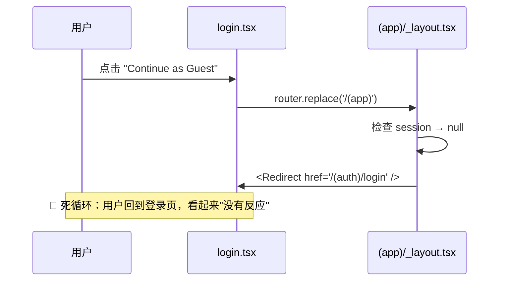

# iOS App Store 审核问题整改方案

> **Submission ID**: c21f8730-4fe6-4c3c-8e4e-73434f363b2c
> **审核日期**: 2026-03-09
> **审核设备**: iPad Air 11-inch (M3) / iPhone 17 Pro Max (iPadOS / iOS 26.3.1)
> **App 版本**: 1.0

---

## 问题摘要

### Guideline 2.1(a) — Continue as Guest 按钮无响应

**审核描述**: 点击 "Continue as Guest" 链接后没有任何反应。

---

## 根因分析

### 核心矛盾：路由守卫与游客模式冲突

整个导航流程涉及 3 个关键文件：

| 文件 | 作用 |
|------|------|
| [login.tsx](file:///Users/nsaviour/Project/WebProject/niubiagent/ios/app/(auth)/login.tsx#L218) | "Continue as Guest" 按钮，点击后执行 `router.replace('/(app)')` |
| [(app)/_layout.tsx](file:///Users/nsaviour/Project/WebProject/niubiagent/ios/app/(app)/_layout.tsx#L16-L18) | `(app)` 路由组的布局守卫 |
| [AuthContext.tsx](file:///Users/nsaviour/Project/WebProject/niubiagent/ios/context/AuthContext.tsx#L49-L54) | 认证上下文，注释声明允许游客访问 |

**Bug 复现路径：**



**问题代码** — `(app)/_layout.tsx` 第 16-18 行：

```tsx
if (!session) {
    return <Redirect href="/(auth)/login" />;
}
```

当 `session` 为 `null`（游客未登录），布局会立即重定向回登录页。而 `login.tsx` 的 "Continue as Guest" 按钮只是简单地 `router.replace('/(app)')`，没有设置任何游客标记。

> [!IMPORTANT]
> `AuthContext` 中的注释（第 49、54 行）明确表示游客可以自由访问地图，但 `(app)/_layout.tsx` 的 `<Redirect>` 守卫与此矛盾，是导致 Bug 的直接原因。

**额外确认**: 全局搜索 `isGuest` / `guestMode` 关键词未找到任何结果，说明当前代码中 **不存在游客模式的状态管理**。

---

## 整改方案

### 方案：在 AuthContext 中增加 `isGuest` 状态

#### 1. 修改 [AuthContext.tsx](file:///Users/nsaviour/Project/WebProject/niubiagent/ios/context/AuthContext.tsx)

- 新增 `isGuest` 状态和 `enterGuestMode` / `exitGuestMode` 方法
- `isGuest` 值同样持久化到 `SecureStore`（key: `guestMode`），确保 App 重启后保留状态
- 在路由守卫逻辑中，已登录用户 **或** 游客模式用户不再被重定向到登录页

```diff
 interface AuthContextType {
     session: string | null;
     isLoading: boolean;
+    isGuest: boolean;
     signIn: (token: string) => Promise<void>;
     signOut: () => Promise<void>;
+    enterGuestMode: () => Promise<void>;
 }
```

- `signIn` 时自动清除 `guestMode` 标记（用户正式登录后，不再是游客）
- `signOut` 时同时清除 `guestMode` 标记

#### 2. 修改 [(app)/_layout.tsx](file:///Users/nsaviour/Project/WebProject/niubiagent/ios/app/(app)/_layout.tsx)

- 将守卫条件从 `!session` 改为 `!session && !isGuest`

```diff
-    if (!session) {
+    if (!session && !isGuest) {
         return <Redirect href="/(auth)/login" />;
     }
```

#### 3. 修改 [login.tsx](file:///Users/nsaviour/Project/WebProject/niubiagent/ios/app/(auth)/login.tsx#L218)

- "Continue as Guest" 按钮点击时先调用 `enterGuestMode()`，再跳转

```diff
-<TouchableOpacity style={styles.skipLink} onPress={() => router.replace('/(app)')}>
+<TouchableOpacity style={styles.skipLink} onPress={async () => {
+    await enterGuestMode();
+    router.replace('/(app)');
+}}>
```

#### 4. 确认已有功能不受影响

`(app)/index.tsx` 第 326-340 行的 `handleModeChange` 已经包含游客用户尝试 draw/pin 时弹出登录提示的逻辑（检查 `!session`），无需修改，游客体验保持一致：
- ✅ 游客可以浏览地图、查看涂鸦和图钉
- ✅ 游客尝试绘画/放置图钉时会弹出登录提示
- ✅ 正式登录后 `isGuest` 自动清除

---

## 验证计划

> [!NOTE]
> 项目中没有发现现有的自动化测试文件。需要通过手动测试验证。

### 手动测试步骤

1. **Guest 流程测试**
   - 冷启动 App → 点击 "Continue as Guest" → 应成功进入地图页面
   - 在地图页面可以正常浏览、缩放地图
   - 点击绘画/图钉工具 → 应弹出登录提示

2. **正常登录流程**
   - 登录页输入邮箱密码 → 正常登录 → 进入地图
   - 可以正常绘画和放置图钉

3. **Guest → 登录转换**
   - 以游客身份进入 → 点击绘画 → 弹出登录提示 → 点击"登录" → 完成登录 → `isGuest` 应清除

4. **App 重启保留状态**
   - 以游客身份进入 → 杀掉 App → 重新打开 → 应直接进入地图（游客状态持久化）
   - 以登录用户身份使用 → 杀掉 App → 重新打开 → 应直接进入地图（登录状态持久化）

5. **登出后状态重置**
   - 已登录状态 → 点击登出 → 应回到登录页

---

## 改动影响评估

| 改动文件 | 改动量 | 风险 |
|----------|--------|------|
| `AuthContext.tsx` | 中等（~20 行） | 低 — 新增字段，不改变已有逻辑 |
| `(app)/_layout.tsx` | 小（~2 行） | 低 — 只放宽守卫条件 |
| `login.tsx` | 小（~3 行） | 低 — 点击事件增加一步操作 |

> [!TIP]
> 所有改动都是**增量式**的，不改变现有的登录/注册/Apple Sign-In 流程，风险很低。
